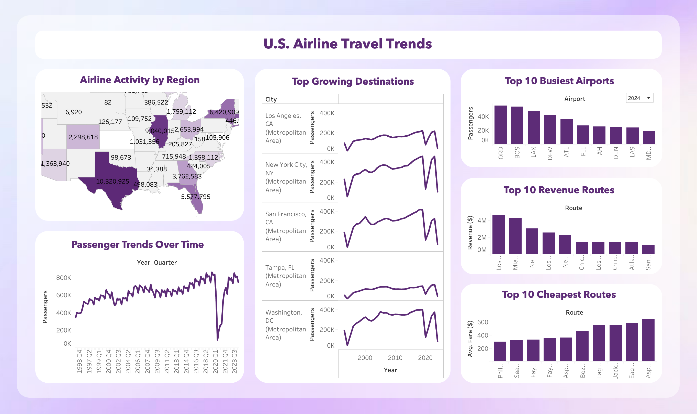

# ✈️ U.S. Airline Travel Trends Dashboard

This Tableau dashboard explores patterns in U.S. domestic airline travel from 1993 to 2024. It provides visual insights into regional air traffic, passenger trends, growing destinations, top-performing routes, and pricing. Designed for stakeholders in the airline or travel sector, the dashboard helps uncover meaningful trends in travel behavior and market opportunities.

## 🖼️ Dashboard Preview

## 📊 Key Visuals

- **Airline Activity by Region**  
  A choropleth map highlighting which U.S. states see the most airline traffic based on passenger counts.

- **Passenger Trends Over Time**  
  A time series showing how domestic airline traffic has evolved by quarter over 30 years.

- **Top Growing Destinations**  
  Line charts tracking long-term passenger volume growth across major metro areas like Los Angeles, NYC, and Washington DC.

- **Top 10 Busiest Airports**  
  A horizontal bar chart ranking airports by passenger volume (filterable by year).

- **Top 10 Revenue Routes**  
  Routes generating the highest total revenue, helping identify high-demand corridors.

- **Top 10 Cheapest Routes**  
  A fare comparison across routes with the lowest average ticket prices — ideal for price-sensitive route planning.

## 💡 Use Cases

- Strategic planning for new airline routes
- Market analysis for budget airline ventures
- Historical trend review for transportation analysts
- Academic or research-based insights into airline industry dynamics

